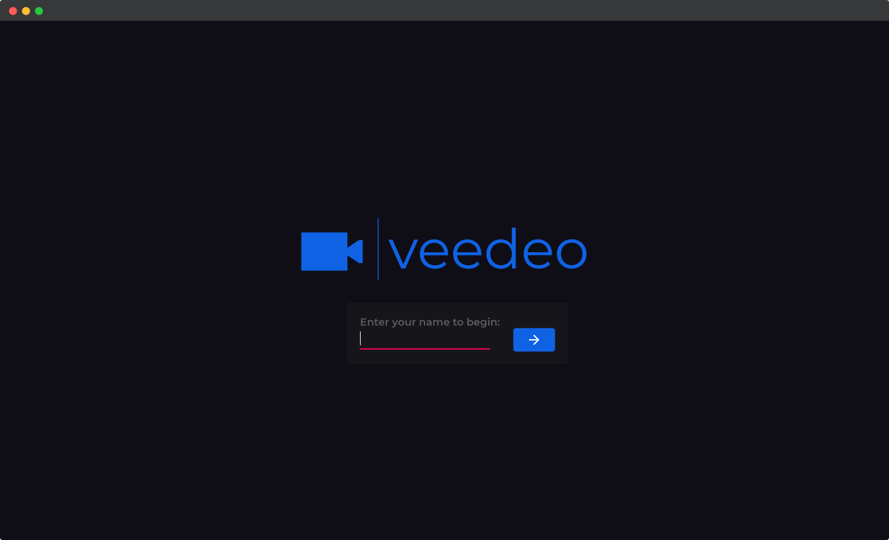

<div id="top"></div>

[![github-follow][github-follow]][github-url]
[![demo][demo-badge]][demo]
[![website][github-pages]][github-pages-url]
[![Issues][issues-shield]][issues-url]
[![MIT License][license-shield]][license-url]
[![LinkedIn][linkedin-shield]][linkedin-url]


<!-- PROJECT LOGO -->
<br />
<div align="center">
  <a href="https://github.com/johansonfelix/coronavirus-tracker">
    
  </a>
  <p align="center">
    A simple Video Chat Web Application built with Node.js as the backend server and React.js on the front end. Veedeo is a free solution
allowing others to meet and communicate over an unmonitored, unlimited video chat session in the browser. The focus is on ease of use.
No data is stored and signup/authentication is not needed. The peer-to-peer communication is designed using the Socket.io JavaScript
library. Additional JavaScript libraries and frameworks are used including Material UI and Animate.css for React component styling. The
application is deployed on Heroku (backend) and on Netlify (frontend). Checkout backend server : <a href="https://github.com/johansonfelix/veedeo">veedeo</a>
    <br />
    <a href="https://github.com/johansonfelix/coronavirus-tracker/blob/main/README.md"><strong>Explore the docs »</strong></a>
    <br />
    <br />
    <a href="https://veedeo.netlify.app//">View Demo</a>
    ·
    <a href="https://github.com/johansonfelix/veedeo-frontend/issues">Report Bug</a>
    ·
    <a href="https://github.com/johansonfelix/veedeo-frontend/issues">Request Feature</a>
  </p>
</div>


<!-- TABLE OF CONTENTS -->
<details>
  <summary>Table of Contents</summary>
  <ol>
    <li>
      <a href="#about-the-project">About The Project</a>
      <ul>
        <li><a href="#built-with">Built With</a></li>
      </ul>
    </li>
    <li>
      <a href="#getting-started">Getting Started</a>
      <ul>
        <li><a href="#prerequisites">Prerequisites</a></li>
        <li><a href="#installation">Installation</a></li>
      </ul>
    </li>
    <li><a href="#usage">Usage</a></li>
    <li><a href="#contributing">Contributing</a></li>
    <li><a href="#license">License</a></li>
    <li><a href="#contact">Contact</a></li>
    <li><a href="#acknowledgments">Acknowledgments</a></li>
  </ol>
</details>


<!-- ABOUT THE PROJECT -->
## About The Project

[![Product Name Screen Shot][product-screenshot]](https://veedeo.netlify.app/)]
A simple Video Chat Web Application built with Node.js as the backend server and React.js on the front end. Veedeo is a free solution
allowing others to meet and communicate over an unmonitored, unlimited video chat session in the browser. The focus is on ease of use.
No data is stored and signup/authentication is not needed. The peer-to-peer communication is designed using the Socket.io JavaScript
library. Additional JavaScript libraries and frameworks are used including Material UI and Animate.css for React component styling. The
application is deployed on Heroku (backend) and on Netlify (frontend). Visit https://veedeo.netlify.app/ for a demonstration.

<p align="right">(<a href="#top">back to top</a>)</p>


### Built With

Veedeo was built with the following technologies:

* [React](https://reactjs.org/) 
* [Socket.io](https://socket.io/)


* Deployed on [Netlify](https://www.netlify.com/)

<p align="right">(<a href="#top">back to top</a>)</p>


<!-- GETTING STARTED -->
## Getting Started

To setup the application on your local environment from a terminal: 


### Installation

1. Clone the repo
   ```sh
   git clone https://github.com/johansonfelix/veedeo-frontend.git
   ```
   and the backend repo 
     ```sh
   git clone https://github.com/johansonfelix/veedeo.git
   ```
2. Install dependencies in your project
    ```sh
  yarn install 
   ```

4. Navigate to backend directory and start server
    ```sh
   yarn nodemon 
   ```
5. Navigate to front end directory and start front end
    ```sh
   yarn start
   ```
6. Test application in browser at localhost:3000

<p align="right">(<a href="#top">back to top</a>)</p>


<!-- USAGE EXAMPLES -->
## Usage




<p align="right">(<a href="#top">back to top</a>)</p>


<!-- CONTRIBUTING -->
## Contributing

Contributions are what make the open source community such an amazing place to learn, inspire, and create.

If you have a suggestion that would make this better, please fork the repo and create a pull request. You can also simply open an issue with the tag "enhancement".
Don't forget to give the project a star! **Thanks again!**

1. Fork the Project
2. Create your Feature Branch (`git checkout -b feature/AmazingFeature`)
3. Commit your Changes (`git commit -m 'Add some AmazingFeature'`)
4. Push to the Branch (`git push origin feature/AmazingFeature`)
5. Open a Pull Request

<p align="right">(<a href="#top">back to top</a>)</p>


<!-- LICENSE -->
## License

Distributed under the MIT License. See `LICENSE.txt` for more information.

<p align="right">(<a href="#top">back to top</a>)</p>


<!-- CONTACT -->
## Contact

* [Johanson Felix](johansonfelix.github.io) - (felix.johanson@gmail.com) 
* [LinkedIn][license-url]</br>
* Project Link: [https://github.com/johansonfelix/veedeo-frontend.git](https://github.com/johansonfelix/veedeo-frontend.git)

<p align="right">(<a href="#top">back to top</a>)</p>


<!-- MARKDOWN LINKS & IMAGES -->
[github-follow]:https://img.shields.io/badge/Follow-black.svg?style=for-the-badge&logo=github&color=555
[github-url]:https://github.com/johansonfelix
[github-pages]:https://img.shields.io/badge/-johansonfelix-red.svg?style=for-the-badge&color=red
[github-pages-url]:https://johansonfelix.github.io
[issues-shield]: https://img.shields.io/github/issues/othneildrew/Best-README-Template.svg?style=for-the-badge
[issues-url]: https://github.com/johansonfelix/coronavirus-tracker/issues
[license-shield]: https://img.shields.io/github/license/othneildrew/Best-README-Template.svg?style=for-the-badge
[license-url]: https://github.com/johansonfelix/coronavirus-tracker/LICENSE.txt
[linkedin-shield]: https://img.shields.io/badge/-LinkedIn-black.svg?style=for-the-badge&logo=linkedin&colorB=555
[linkedin-url]:https://www.linkedin.com/in/johanson-felix-336a94186/
[product-screenshot]: images/Ivana.png
[demo]:https://veedeo.netlify.app/
[demo-badge]:https://img.shields.io/badge/-demo-green.svg?style=for-the-badge&color=green
